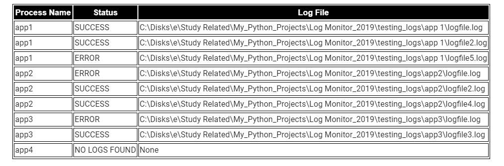

# Log Monitoring Tool in Python  
This is a log monitoring tool developed in Python which monitors logs and notifies team accordingly. When this application is executed it performs a keyword search on the logs presnet in the paths specified in the configures and sends out notifications to configured email addresses. Below are the frameworks used in this application:  
 - Python  
 - Pandas  
 - Sendgrid for Email notifications  

Below is a brief description about the application and how to use it. This is the first release of the application and I am working on more enhancements to come up with an advanced version of the application. Some of the enhancements on roadmap:  
 - More fuzzy search and not a direct keyword search  
 - Other notification channels like SMTP email support, Slack channels
 - More log type support like other format of logs, logs in clod locations like S3  

 The full code can be found at:  
 https://github.com/amlana21/logmonitoringpython

## How to use  

### Pre Requisites  
Below are the packages or frameworks need to be installed before the application runs:  
  - Python  
  - Install all packages from requirements.txt  
  - Virtual environment  
  - An API Key from sendgrid (https://sendgrid.com)  

### Usage  

Before running the application, some configuration settings need to be provided in different config files. Below are the files which need to be edited to setup options for the application. Both of the files are under resources folder:  

 - <em>params.properties: </em>Below are the different options which can be set to control the behavior of the application: 
    - emailaddress: Comma separated email Ids to which it will send notifications  
    - keywords: A list of keywords which the application will look in the logs to identify errors. If any of these keywords are present in any of the logs, the application will report it as a failure  
    - smtphost,smtpuser,smtppwd: Reserved for a future enhancement to support SMTP settings  
    - from: The email notifications will show this as the from email  
    - subject,body: Email Subject and Body content of the error email notifications sent out  
    - numberofjobs: Number of applications whose logs it will monitor  
    - logmodifiedduration(minutes): The application will only check for logs which are modified within the minutes mentioned in this parameter. This will ensure it only picks up latest log files and not everything.  
    - lastrunflag: Keep the values as Y  
    - logtype: This is the type of log which it will work on. For now it supports csv and txt. Specifying either of them will enable the application to monitor all logs which are in text format.  
    - wholewordsearch: Keep this as Y. Placeholder for a future enhancement to support fuzzy search  
    - sendmode: There are two modes supported by the application:  
        - Summary: It will send summary notifications each time it is executed. The application will search all the logs specified in the path locations and send out a summary for each log its monitoring.  
        - Error: It will only send out email notification when it finds a match for the keyowrds in the monitored logs  
    - sendattachments: This parameter controls whether the log file is sent as an attachment to the email or not. Based on the selection, the monitored log file is attached to the email notification which is sent out.Allowed values- Y or N.  
    - summarysubject, summarybody: Email subject and body content when Summary is selected as the mode. 
    - sendgrid_api: The api key for the sendgrid account which the tool will use to send out emails  

 - <em>paths.csv: </em>A comma separated file listing out each app name and corresponding log location. These locations will be monitored by the application. A sample file has been included in the Github repo.  

Once the configuration settings are done, the application can be executed on demand or on a schedule to monitor the logs. Whenever the application is ran, it will search the log files for the keywords and based on the config settings, it will send out notifications.

To execute the application a virtual environment need to be activated or the frameworks from the requirements.txt file need to be installed wherever the application is planned to run. To use virtual environment:  
 - Create virtual environment  
 ```python -m venv log_monitor_env```  
 - Install dependencies  
 ``` pip install -r requirement.txt```  
 - Run the app  
 ```python main.py```  

 Below is an example of the Summary email which gets sent out from the app  

   

 ## Technical details  

The application consists of a set of classes which define various functionalities of the application. Below is a high level flow of the program and how it handles the monitoring:  

 - The program reads all the input parameters and the paths from the resources folder  
 - Based on the config settings, a log object is initialized from the logfile class. This calls the method to read the log and perform the keyword search on each of the log files  
 - Once th log files are scanned, an email object is instantiated from the email communications class  
 - The email object takes the output from the log scan and builds the email body based on the settings from the config file  
 - Based on the send mode selected in the config, separate methods are called to prepare different email content
 - Once the email body is complete(based on Summary or Error selected in the config), it calls the SendGrid API to send out the necessary emails. It uses the API Key specified in the config  
 - All the steps performed in the code are logged in log files in the logs folder. These are logs created by the loggerclass.  


## Conclusion  
This is a very direct keyword search application which searches for the exact keywords in the log files. This can be used to monitor applications which generate log files in some specific folders .As long as the monitored applications have a specific path where the log files can be found, this application can process those logs. There are possible enhancements which can be done on this application and I am working on releasing a next version of this code with more enhancements. Until then for any questions reach me at amlanc@achakladar.com.